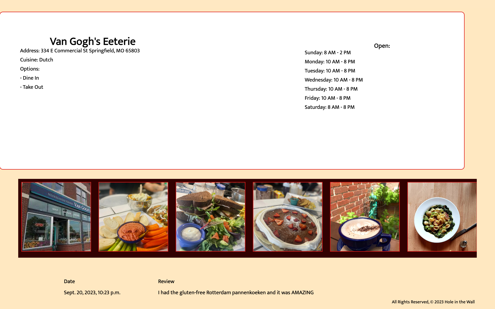
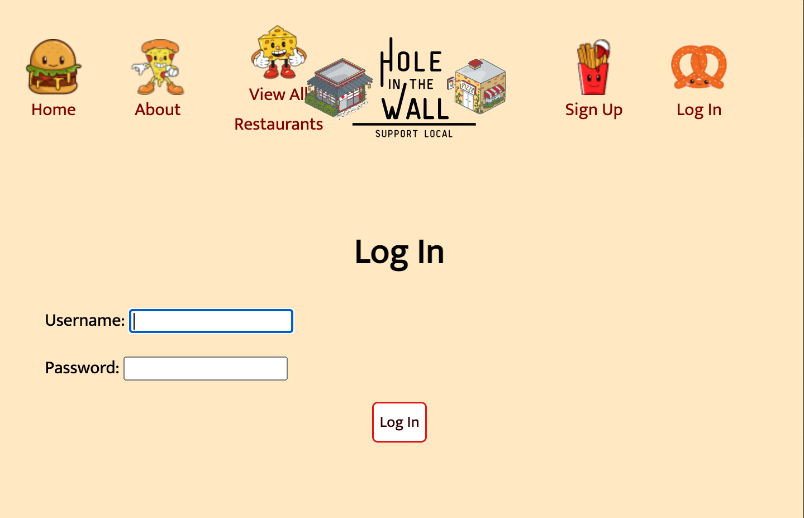
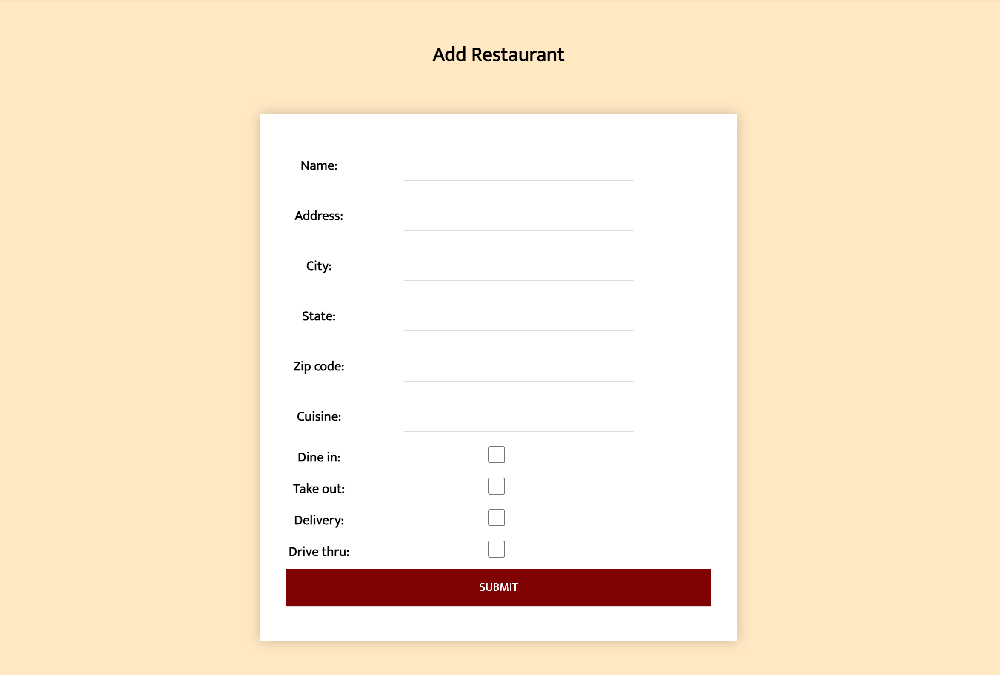
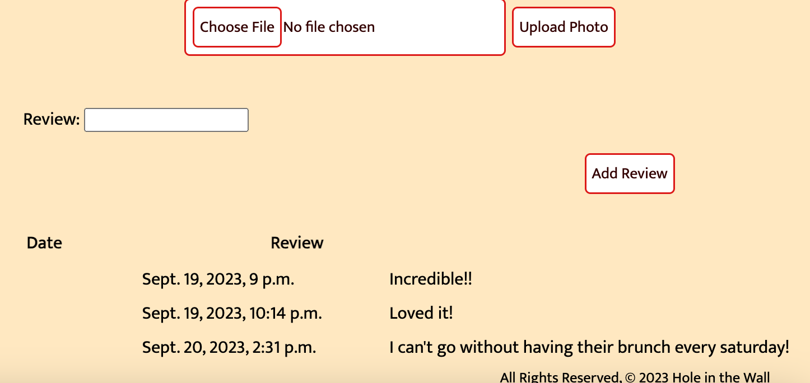
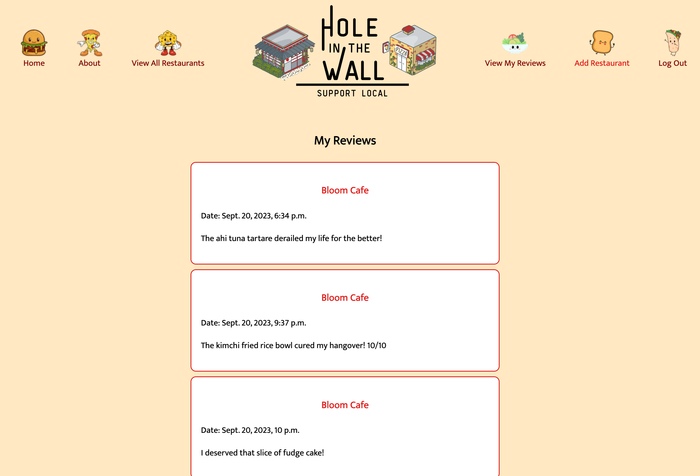
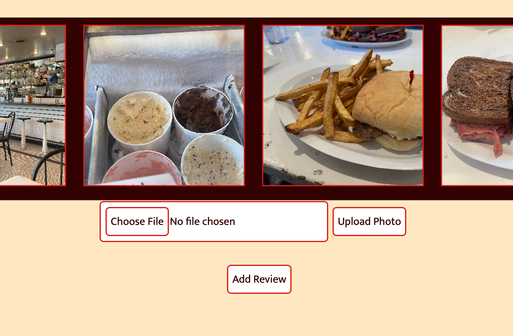

# Hole in the Wall 

### Welcome all food lovers to Hole in the Wall! Your one-stop (family-owned) shop to finding the best of the best local eateries! Our mission is simple:

1. Provide a platform to showcase specifically independently owned restaurants. Not only does this support your community but it gives YOU an opportunity to discover your new favorite joint!

2. Why all the negativity? We want to prioritize our platform for positive experiences. Did you love your meal? Share it on Hole in the Wall and connect your favorite businesses with new patrons.

## Launch here: [Hole in the Wall](https://holeinthewall-jrt-011e87d16f7e.herokuapp.com/) 

## Welcome Page

Upon loading, you’re free to browse all user added restaurants...

...including their basic information such as address, hours of operation and text and photo reviews.

## Join Us:  Sign In or Sign Up 

Click the pretzel to login or the fries to sign up, by creating an account you’re given full access to everything Hole in the Wall has to offer...

...lets get into it!

## Add a Restaurant

Don’t see your favorite joint? Honor it by adding it to Hole in the Wall’s exclusive restaurant index.

## Leave a Review

Adding a restaurant is only scratching the surface. Give praise or share your favorite dishes by leaving a review. If you change your mind, you can always delete it.

## Review Index 

Keep track of all your reviews with ease via ‘View My Reviews’ tab.

## Upload a Photo Review(screenshot)

Loved the presentation? Make a thousand word review by uploading a photo.

## Technologies:

Python, Django, PostgreSQL, HTML, CSS, AWS
